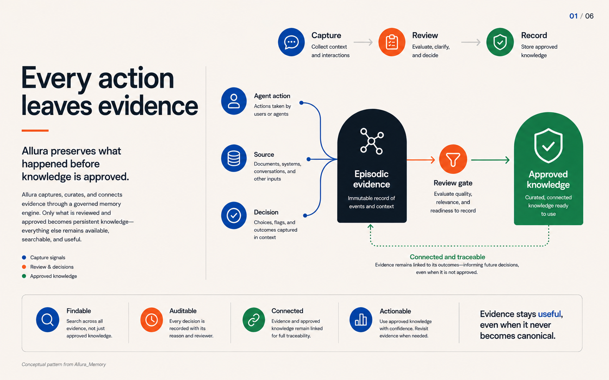
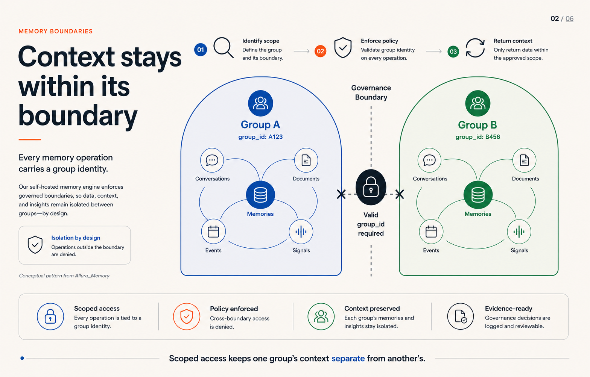
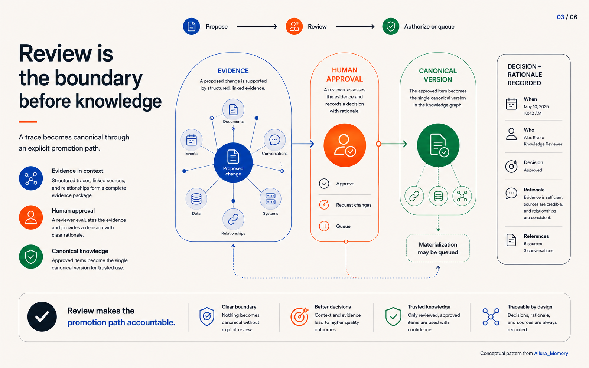
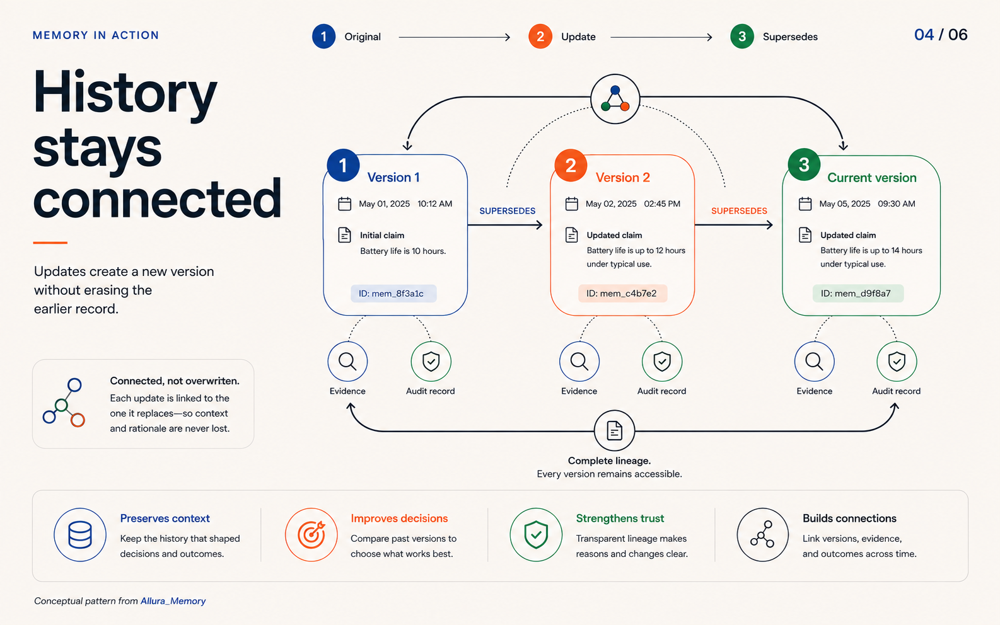
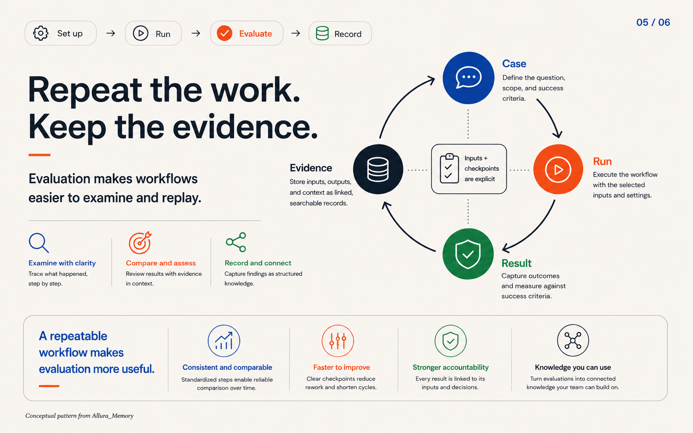
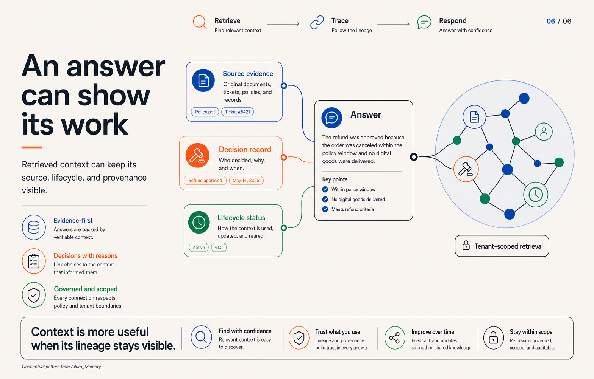

<p align="center">
  
</p>

<h1 align="center">Governed Memory Infrastructure for AI Agents</h1>

<p align="center">
  <a href="https://github.com/Allura-Ecosystem/Allura_Memory/actions/workflows/ci.yml"></a>
  <a href="https://github.com/Allura-Ecosystem/Allura_Memory/actions/workflows/check.yml"></a>
  <a href="https://github.com/Allura-Ecosystem/Allura_Memory/actions/workflows/integration-tests.yml"></a>
  <a href="https://github.com/Allura-Ecosystem/Allura_Memory/blob/main/LICENSE"></a>
</p>

<p align="center">
  <strong>Self-hosted memory, review-gated knowledge, and auditable retrieval.</strong><br/>
  Allura captures what agents do, preserves the evidence, and returns approved context with provenance.
</p>

<p align="center">
  <a href="#why-allura-memory">Why Allura</a> ·
  <a href="#product-walkthrough">Product walkthrough</a> ·
  <a href="#product-explainers">Product explainers</a> ·
  <a href="#architecture">Architecture</a> ·
  <a href="#how-allura-earns-trust">How Allura earns trust</a> ·
  <a href="#getting-started">Getting started</a> ·
  <a href="#mcp-api">MCP API</a> ·
  <a href="#operations">Operations</a> ·
  <a href="#documentation">Documentation</a>
</p>

---

<p align="center">
  <a href="https://allura-governed-demo.vercel.app"></a>
</p>

## Product walkthrough

The deployed [Epic 25 interactive demo](https://allura-governed-demo.vercel.app) is the visual walkthrough for this repository. It uses synthetic specimen data and explicitly does not claim a live connection, production authorization, or an automated decision.

- **Command Center** — inspect a review packet before a qualified person acts.
- **Framework & Harness** — show fail-closed boot, database-enforced boundaries, deterministic replay, and the measured evaluation surface.
- **Governance** — show the separation between context, policy, a human decision, and a recorded receipt.

## Product explainers

Six branded visuals explain the framework, harness, governance, and evidence model behind the walkthrough. Each carries the Allura wordmark, the canonical palette, and a source citation.

|  |  |
| --- | --- |
| <a href="docs/portfolio/allura-agentic-framework-harness/infographics/png/01-framework-harness-architecture.png"></a><br/><sub><strong>Framework and harness architecture</strong></sub> | <a href="docs/portfolio/allura-agentic-framework-harness/infographics/png/02-deterministic-harness.png"></a><br/><sub><strong>Deterministic harness</strong></sub> |
| <a href="docs/portfolio/allura-agentic-framework-harness/infographics/png/03-enterprise-governance.png"></a><br/><sub><strong>Enterprise governance</strong></sub> | <a href="docs/portfolio/allura-agentic-framework-harness/infographics/png/04-developer-interfaces.png"></a><br/><sub><strong>Developer interfaces</strong></sub> |
| <a href="docs/portfolio/allura-agentic-framework-harness/infographics/png/05-governed-memory-lifecycle.png"></a><br/><sub><strong>Governed memory lifecycle</strong></sub> | <a href="docs/portfolio/allura-agentic-framework-harness/infographics/png/06-evidence-to-release-chain.png"></a><br/><sub><strong>Evidence to release chain</strong></sub> |

## Why Allura Memory

Agent memory is easy to demo and difficult to trust. A production system must answer more than “did search return something?”:

- Where did this memory come from?
- Which agent and runtime recorded it?
- Which tenant owns it?
- Has anyone reviewed it?
- Is it current, superseded, disputed, or deleted?
- Can an operator reconstruct the decision later?
- Does a degraded dependency change the answer?

Allura Memory is built around those questions. It separates **episodic evidence** from **semantic knowledge**, then places a governance boundary between them.

> **Logs are not knowledge. A trace becomes canonical only through an explicit promotion path.**

### At a glance

| Capability | Current implementation |
|---|---|
| Runtime | Bun + TypeScript |
| Protocol | Model Context Protocol over stdio and Streamable HTTP |
| Episodic layer | PostgreSQL 16, append-only events, pgvector embeddings |
| Semantic layer | PostgreSQL graph tables through the RuVector adapter |
| Search | Hybrid semantic and full-text retrieval |
| Governance | RuVix policy gate, tenant scoping, and governed promotion |
| Versioning | Immutable history with `SUPERSEDES` lineage |
| Operations | Health, readiness, audit, benchmark, recovery, and curator tools |
| Deployment | Docker Compose or direct Bun runtime |

## Core model

Allura uses one PostgreSQL engine with two governed logical layers.

| Layer | Stores | Purpose | Authority |
|---|---|---|---|
| **Episodic** | events, traces, proposals, audit metadata | Preserve what happened and what was observed | Evidence, not final truth |
| **Semantic** | `graph_memories`, `graph_supersedes`, structural nodes and edges | Serve curated, versioned knowledge | Canonical after approved materialization |

### Governed lifecycle

1. An agent calls `memory_add` with content, `group_id`, and actor identity.
2. Allura writes an append-only episodic event.
3. The content is scored and embedded.
4. Eligible content may be queued as a proposal.
5. Governance review records the decision, actor, rationale, and source reference. Human approval is the accountable boundary; automated curator behavior remains under review.
6. Approval authorizes or queues a canonical semantic version; materialization is not universally instantaneous.
7. After materialization, `memory_search` can return approved, tenant-scoped context with lifecycle metadata.
8. Updates create a new version that supersedes the old one.

<p align="center">
  <a href="https://allura-governed-demo.vercel.app"></a>
</p>

Rejected or low-confidence content can remain useful evidence without becoming canonical knowledge.

## Architecture

```text
MCP client
    │
    ▼
Canonical stdio server or HTTP gateway
    │
    ▼
RuVix governance boundary
    ├── validate identity + group_id
    ├── enforce policy and budgets
    └── append audit evidence
    │
    ▼
PostgreSQL 16 + pgvector
    ├── episodic events and proposals
    ├── vector/full-text retrieval
    └── RuVector graph tables
            │
            ▼
        approval authorizes or queues
            │
            ▼
    canonical materialization
```

### Architectural boundaries

- **All reads and writes are scoped.** A valid `group_id` is required; production tenants follow the `allura-*` namespace.
- **Raw history is append-only.** Soft deletion and updates create events instead of erasing evidence.
- **Canonical knowledge is versioned.** Changes create supersession lineage.
- **Promotion is governed.** `memory_promote` requests review; it does not bypass the curator.
- **Storage is behind an interface.** Agent-facing clients use MCP/API operations instead of direct database access.
- **Failure is visible.** Health and retrieval responses expose degraded state and warnings.
- **Third-party substrate is attributed.** The retrieval accelerator (RuVector, MIT) is credited and scoped in [THIRD_PARTY_NOTICES.md](THIRD_PARTY_NOTICES.md); the governed memory layer is original. See [Attribution](#attribution).

<p align="center">
  <a href="https://allura-governed-demo.vercel.app"></a>
</p>

### RuVector boundary

RuVector is the semantic execution layer; Allura is the governance layer.

| RuVector adapter owns | Allura owns |
|---|---|
| Graph-table persistence | Tenant identity and scope |
| Similarity and relationship operations | Approval and authorization |
| Search execution | Provenance and audit |
| Supersession primitives | Policy and lifecycle meaning |

The `GRAPH_BACKEND=ruvector` adapter is a PostgreSQL-table implementation. It is distinct from the optional native RuVector extension.

### Attribution

Allura is built with and inspired by [RuVector](https://github.com/ruvnet/RuVector) (MIT, © 2025 rUv). RuVector's vector and graph-memory substrate accelerates retrieval; Allura's original contribution is the governed layer around it — tenant scoping (`group_id`), human-review-gated promotion, `SUPERSEDES` lineage, and the audit trail. See [THIRD_PARTY_NOTICES.md](THIRD_PARTY_NOTICES.md) for the full notice, license text, and what each project owns.

## How Allura earns trust

These conceptual visuals explain patterns implemented in the repository. They are not a live system view.

<p align="center">
  
</p>

| | |
| --- | --- |
|  |  |
| Allura preserves episodic evidence before a reviewed promotion path can create canonical knowledge. | Every read and write carries a `group_id` so tenant context stays isolated within its approved boundary. |
| *Source: Allura_Memory README and architecture documentation.* | *Source: Allura_Memory README and architecture documentation.* |
| | |
|  |  |
| Promotion through the curator requires governed review before episodic evidence becomes semantic knowledge. | Updates create a new version that supersedes the old one, so history stays connected through `SUPERSEDES` lineage. |
| *Source: Allura_Memory README and architecture documentation.* | *Source: Allura_Memory README and architecture documentation.* |
| | |
|  |  |
| Evaluation runs are repeatable workflows whose results are retained as evidence alongside the decisions they inform. | Retrieved context carries its source reference, review decision, and lifecycle status so an answer can always show its work. |
| *Source: Allura_Memory README and architecture documentation.* | *Source: Allura_Memory README and architecture documentation.* |

## Getting started

### Prerequisites

- Docker Engine with Docker Compose
- Bun 1.3.14 for local development and validation (pinned in `package.json`)
- An embedding provider: Ollama, OpenAI, Voyage, or a compatible endpoint

### Clone and configure

```bash
git clone https://github.com/Allura-Ecosystem/Allura_Memory.git
cd Allura_Memory
bun install

cp .env.example .env
touch .env.local
```

Fill the required values in `.env` or place local secret overrides in the gitignored `.env.local`. At minimum, review:

```bash
POSTGRES_DB=allura
POSTGRES_USER=allura
POSTGRES_PASSWORD=<required>
DATABASE_URL=postgresql://allura:<password>@localhost:5432/allura

GRAPH_BACKEND=ruvector
PROMOTION_MODE=soc2
AUTO_APPROVAL_THRESHOLD=0.85

EMBEDDING_PROVIDER=ollama
EMBEDDING_MODEL=qwen3-embedding:8b
RUVECTOR_EMBEDDING_BASE_URL=http://localhost:11434

RUVIX_CONTROL_PLANE_SECRET=<minimum-32-character-secret>
ALLURA_MCP_TOKEN_SECRET=<minimum-16-character-secret>
```

### Start the containerized service

```bash
docker compose --env-file .env --env-file .env.local up -d
curl http://localhost:6477/ready
```

The Compose stack runs:

| Service | Host binding | Purpose |
|---|---|---|
| `postgres` | `127.0.0.1:5432` | Episodic, semantic, vector, and audit storage |
| `mcp` | `6477:3201` | Canonical MCP HTTP gateway |

The database is loopback-only. Remote and LAN clients should connect through the governed gateway, not PostgreSQL.

### Run directly for development

```bash
# Canonical stdio server
bun run mcp

# Canonical HTTP gateway; defaults to port 3201
bun run mcp:http
```

### Connect an MCP client

Streamable HTTP against the Compose stack:

```json
{
  "mcpServers": {
    "allura": {
      "url": "http://localhost:6477/mcp"
    }
  }
}
```

Stdio from a local checkout:

```json
{
  "mcpServers": {
    "allura": {
      "command": "bun",
      "args": ["src/mcp/memory-server-canonical.ts"],
      "cwd": "/absolute/path/to/Allura_Memory"
    }
  }
}
```

## First memory round trip

All calls are tenant-scoped. Write operations also identify the actor for provenance.

```typescript
const created = await memory_add({
  group_id: "allura-myteam",
  user_id: "brooks-architect",
  content: "Decision: canonical promotion requires curator approval.",
  metadata: {
    source: "conversation",
    agent_id: "brooks"
  }
});

const results = await memory_search({
  group_id: "allura-myteam",
  query: "canonical promotion policy",
  status: "approved",
  limit: 5
});
```

Fresh writes are episodic. They may be searchable for operational workflows, but they are not approved truth until they complete the curator path.

## MCP API

### Memory tools

| Tool | Purpose |
|---|---|
| `memory_add` | Append a memory event, score it, and queue eligible content |
| `memory_search` | Search scoped episodic and/or approved semantic memory |
| `memory_get` | Retrieve one memory by ID |
| `memory_list` | List a user's memories within a tenant |
| `memory_update` | Create a versioned update with supersession lineage |
| `memory_delete` | Soft-delete a memory while preserving audit history |
| `memory_restore` | Restore a soft-deleted memory during the recovery window |
| `memory_promote` | Request curator promotion for an episodic memory |
| `memory_export` | Export tenant-scoped memory data |
| `memory_list_deleted` | Inspect recoverable soft-deleted memories |

### Governance tools

| Tool | Purpose |
|---|---|
| `governance_list_policies` | List active invariant policies |
| `governance_get_policy` | Read one canonical policy |
| `governance_check_gate` | Evaluate an action against governance invariants |
| `governance_list_proposals` | List pending, approved, or rejected proposals |
| `governance_proposal_approve` | Apply a curator approval to one proposal |
| `governance_proposal_reject` | Reject a proposal with rationale |
| `governance_audit_log` | Read governance events and approval consumption |

### Audit and health tools

| Tool | Purpose |
|---|---|
| `audit_query_events` | Query append-only events with filters |
| `audit_agent_activity` | Inspect activity attributed to one agent |
| `audit_health_report` | Check database, semantic adapter, embedding, queue, and MCP health |
| `audit_invariant_check` | Validate governance invariants against live data |

See [`.github/API-REFERENCE.md`](.github/API-REFERENCE.md) and [`docs/reference/`](docs/reference/) for request and response contracts.

## Governance

| Invariant | Required behavior |
|---|---|
| Tenant isolation | Every operation includes a valid `group_id` |
| Append-only evidence | Trace history is not rewritten or hard-deleted |
| Versioned knowledge | Updates preserve the prior version and relationship |
| Governed promotion | Agents request promotion; an authorized curator path records the decision and may queue canonical materialization |
| Governed access | Agent clients use MCP/API boundaries |
| Namespace control | Governed tenant identifiers use the `allura-*` namespace |

### Promotion modes

The documented governance posture is `PROMOTION_MODE=soc2`, which routes eligible candidates through review. `memory_add` queues eligible records rather than treating `PROMOTION_MODE=auto` as score-based truth. Separately, the admin-only `governance_curator_pass(mode="auto")` path can batch-approve and materialize threshold-passing proposals; the HTTP gateway identifies that operation as a HITL bypass. Human approval remains the accountable boundary in the public governance model, while this automated curator path remains an explicit policy-resolution item.

## Operations

### Health endpoints

| Endpoint | Meaning |
|---|---|
| `GET /health` | Process liveness and basic service status |
| `GET /ready` | Dependency readiness; returns `503` when required checks fail |
| `POST /mcp` | Streamable HTTP MCP endpoint |

### Common commands

```bash
bun run typecheck
bun run test
bun run test:e2e
bun run test:all

bun run curator:run
bun run curator:approve
bun run curator:reject

bun run benchmark
bun run backfill:embeddings
bun run brain:status
```

### Validation expectations

- Unit and type checks validate local contracts.
- E2E suites require live infrastructure and are gated by `RUN_E2E_TESTS=true`.
- Health output is runtime evidence, not a substitute for functional tests.
- A “done” claim should identify the command, result, and relevant artifact.
- Required pull-request validation produces a commit-bound evidence manifest; see the [capability matrix](docs/portfolio/capability-matrix.md) and [evidence index](docs/portfolio/evidence-index.md).

## Repository map

```text
Allura_Memory/
├── src/mcp/                 canonical MCP servers and tools
├── src/control-plane/              RuVix policy and enforcement boundary
├── src/lib/graph-adapter/   PostgreSQL/RuVector graph interface
├── src/curator/             scoring, proposals, approval, and workers
├── src/lib/audit/           audit and isolation checks
├── docker/postgres-init/    schema and migration bootstrap
├── scripts/                 operations, validation, recovery, and setup
├── docs/allura/             canonical architecture documentation
└── docs/reference/          API and terminology reference
```

## Documentation

| Document | Use it for |
|---|---|
| [`docs/allura/BLUEPRINT.md`](docs/allura/BLUEPRINT.md) | Core concepts, requirements, topology, data model |
| [`docs/allura/SOLUTION-ARCHITECTURE.md`](docs/allura/SOLUTION-ARCHITECTURE.md) | Runtime boundaries and deployment scenarios |
| [`docs/allura/DESIGN-ALLURA.md`](docs/allura/DESIGN-ALLURA.md) | Implementation design |
| [`docs/allura/DATA-DICTIONARY.md`](docs/allura/DATA-DICTIONARY.md) | Tables, fields, and relationships |
| [`docs/allura/REQUIREMENTS-MATRIX.md`](docs/allura/REQUIREMENTS-MATRIX.md) | Requirement-to-evidence traceability |
| [`docs/allura/RISKS-AND-DECISIONS.md`](docs/allura/RISKS-AND-DECISIONS.md) | ADRs, risk posture, and superseded decisions |
| [`docs/portfolio/capability-matrix.md`](docs/portfolio/capability-matrix.md) | Implemented/planned claims and their independent evidence state |
| [`docs/portfolio/evidence-index.md`](docs/portfolio/evidence-index.md) | Commit-bound CI evidence and controlled failure proof |

When documentation disagrees, use this authority order: current code and schema → accepted ADRs → canonical architecture docs → operational notes.

## Claims and limitations

Allura provides:

- tenant-scoped persistent memory;
- append-only evidence and audit events;
- governed approval before canonical materialization;
- versioned knowledge and soft deletion;
- MCP-native integration;
- self-hosted data ownership.

Allura does not claim:

- formal SOC 2, ISO 27001, or equivalent certification;
- elimination of model hallucination;
- autonomous truth verification;
- that a confidence score replaces human review;
- performance superiority over specialized vector databases.

## Brand

Allura Memory uses Allura Blue `#0D47A1`, Orange `#FF4D1F`, Green `#14BA4B`, Ink `#0F1720`, and Cream `#F7F3EE`. Aeonik is the primary communication face; IBM Plex Mono is reserved for code and technical identifiers.

## License

MIT

---

<p align="center">
  <strong>Memory is the foundation. Intelligence is the outcome.</strong>
</p>
